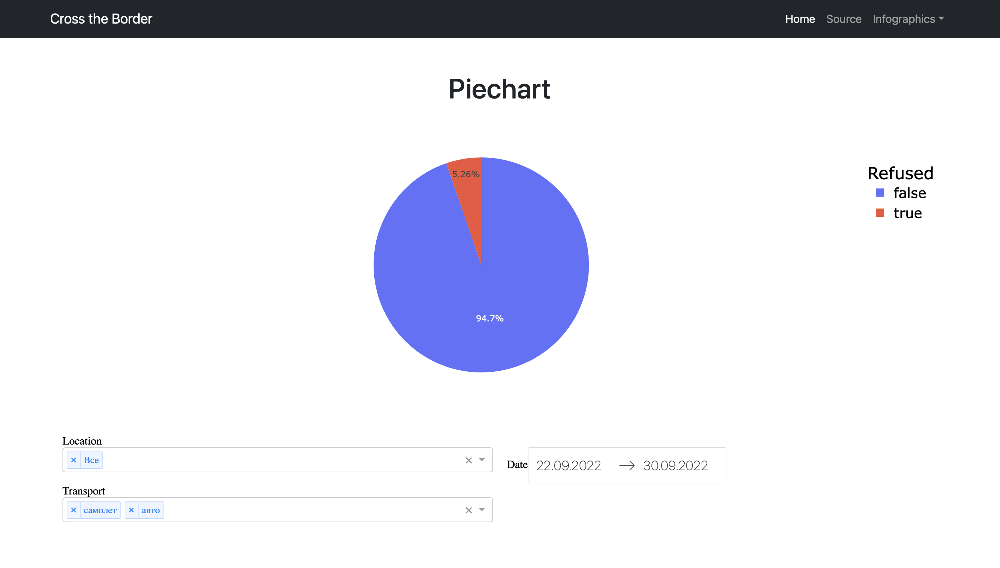
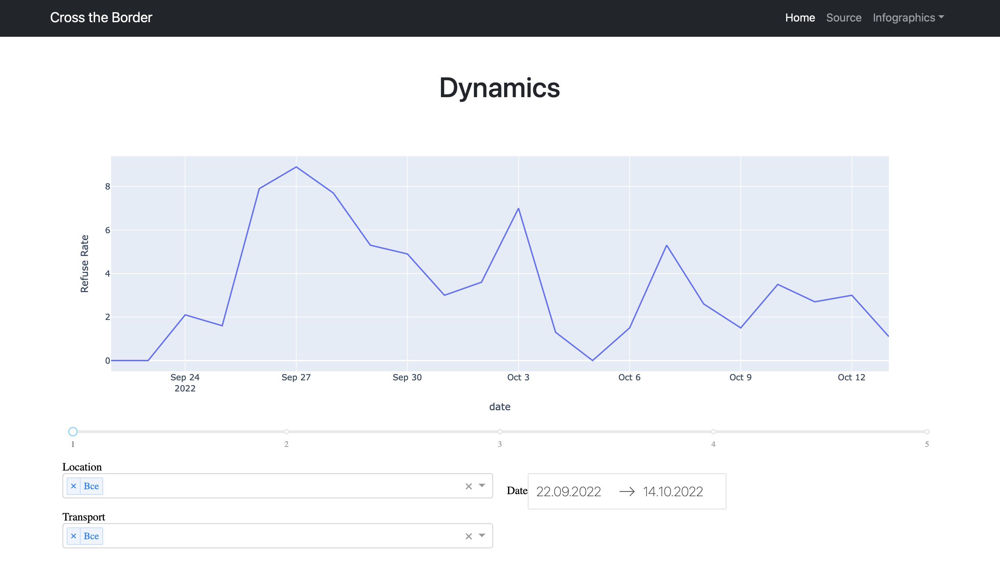

This project is designed to monitor the chances to pass Russain borders. It fetches data from the
«Пограничный контроль» telegram channel in real time and presents it via dashboards on the website. Telegram scraper and website instance are run separately as a mean of scalability

**To run application on your local machine:**
1) Create ./PKparser/config.ini file with following contents
    ```Git config
   [Telegram]
    api_id = <telegram api id>
    api_hash = <telegram api hash>
    username = bot
    channel_url = https://t.me/<channel name>
   ```
2) Run
   ```
   docker compose build --no-cache
   docker compose run tg_scraper
   ```
   from the root directory
3) Enter phone number for your telegram account and access code, when asked.
Bot token would not suffice!
4) Install requirements for PKsite in PKsite/project/reuirements.txt
You might want to do that in venv.
5) Run
   ```
   python PKsite/project/manage.py runserver
   ```
6) Go to http://127.0.0.1:8000/ to access the website. 

**Dashboard examples:**



